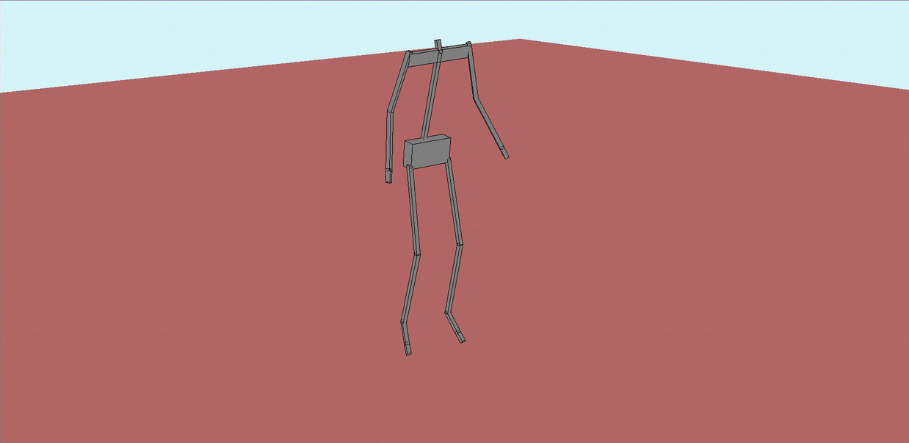
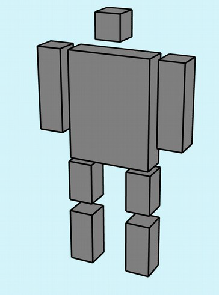
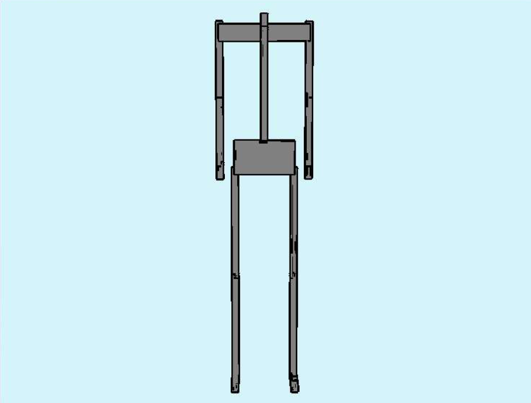
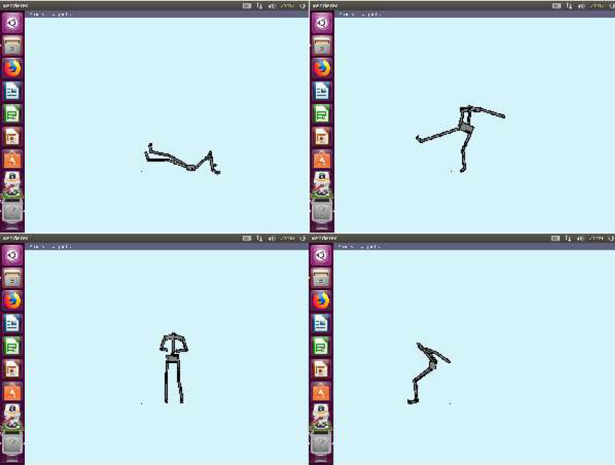
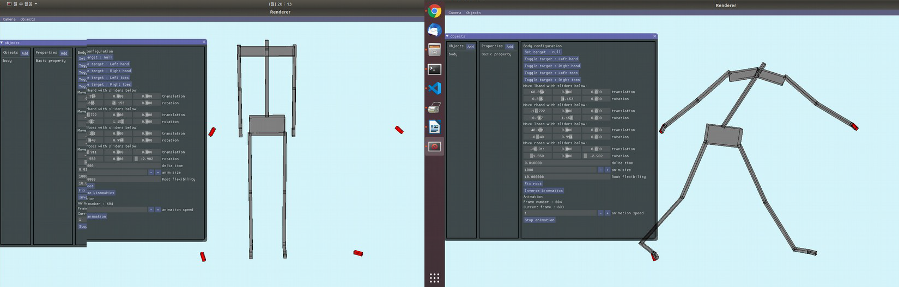
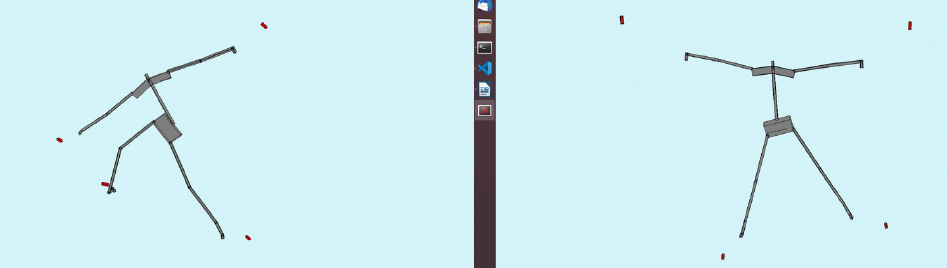
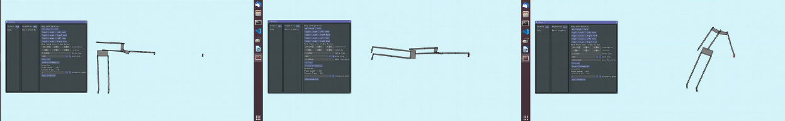
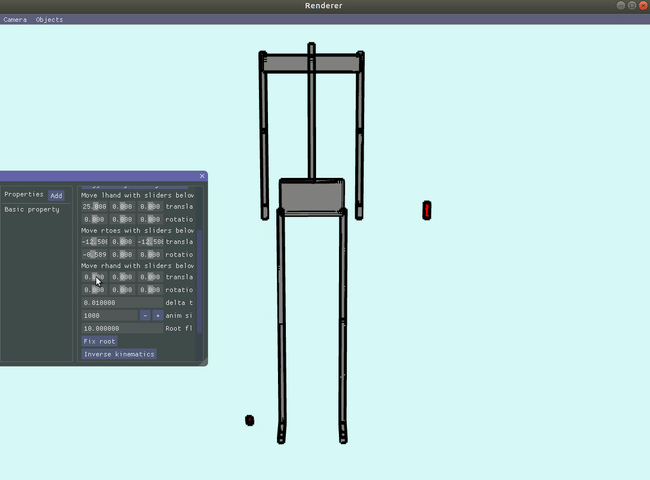
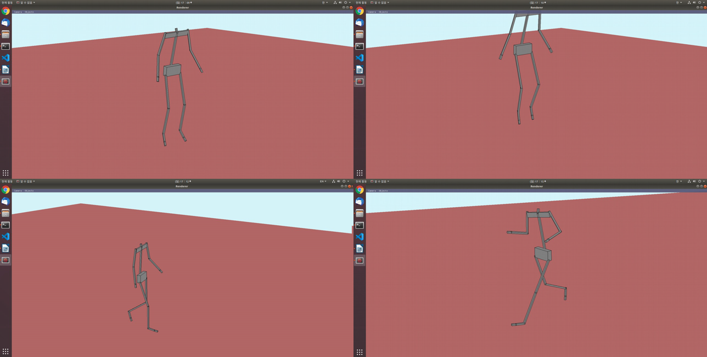

# Course-Project_Advanced-Animation

  

This repository contains code that I submitted as assignments for **4190.663A Advanced Animation** course at SNU in 2019.

## HW 1 : Creating a hierarchical human model

Human model is comprised of head, body, arms and legs. The model is naturally hierarchical model, using body as a root node. When conducting rendering calls, each body part is rendered in hierarchical order - **link and joint transformations** are applied in that order. There are two kinds of joint tranformations : Ball-and-socket joint and revolute joint. 

  

## HW 2 : Parsing .bvh file and playing animation

For given .bvh file, parse model information and animation information in the file. Since animation information is presented as joint angles, just apply it to joint transformations.

  
  

## HW 3 : Inverse kinematics

User can give objectives to a human model. The objectives, or constraints, can be given to both hands and feet. To do the inverse kinematics, the program solves systems of linear equations. If the equations are not solvable, just give the result with minimum error. As there are more constraints, more computation time is needed to solve systems of linear equations. User can give time delta value to use in solving the equations. User can also make root node to float around to make better motions.

  
  
  
  

## HW 4 : Motion state transition

  

User can specify motion graph that contains several motion states : In each state, own animation is repeated recursively. To concatenate different animations seamlessly, the program interpolates the final and first motion of last state and new state. 
